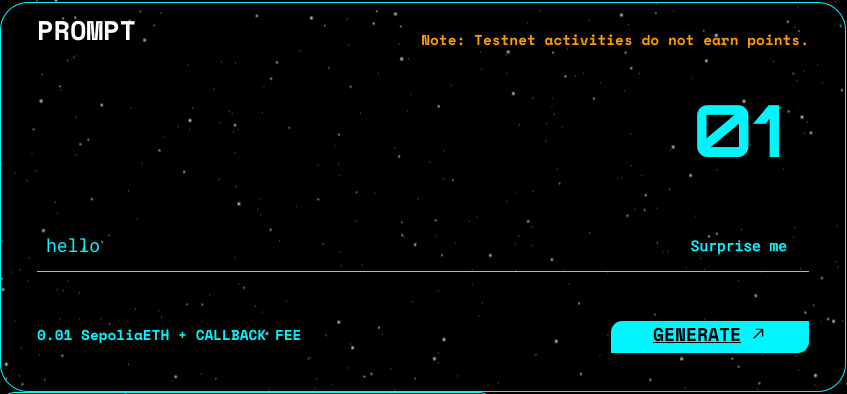

This repo contains the docker compose file and .env configuration file for starting the TORA validator.

You can quickly start a TORA validator through this repo and participate in the ORA protocol.

To learn about how to use and build on ORA read the [docs](https://docs.ora.io/doc).

# Usage
### 0. Requirements

TORA validator has no specific requirements for the operating system. It can run on macOS, Linux, or Windows. 

Please confirm that your computer has Docker installed and ensure there is a stable network connection. The installation, operation, and upgrade of TORA validator will be completed based on Docker.

#### Mininal requirements

To run a TORA validator your computer must have:
- Any Operating System but Docker installed.
- 1-core CPU and 8 GB RAM. This configuration is sufficient to run an openLM model server.

Please ensure that there is sufficient balance in the wallet used for `confirm`, which can be used to pay for gas of [transaction](https://sepolia.etherscan.io/tx/0x4f18a1ae40fceeed1ac771097e0cca90f843bb2fe77bee53c3dbd71d5e05a012).

#### Optimal requirements

You can optimize the inference process by using GPU. Your GPU needs at least 8GB of memory.
We conducted tests on Nvidia graphics cards, and the average inference time will be reduced from 15 minutes to around 2 seconds.

### 1. Setup
```shell
git clone https://github.com/ora-io/tora-validator.git && cd tora-validator
mv .env.example .env && vim .env # modify environment variables
```
`PRIV_KEY` `MAINNET_WSS` `MAINNET_HTTP` `SEPOLIA_WSS` `SEPOLIA_HTTP` variables are required.

### 2. Start
```shell
docker compose up
```

The startup process of the docker container will take about 20 seconds. When `[+] all model servers are up!` appears, everything is ready.

```log
2024-08-28 21:55:04 ora-confirm  | 1:55:04 PM [tora] Start Tora in production environment
2024-08-28 21:55:04 ora-confirm  | 1:55:04 PM [confirm] [*] waiting for all model servers up...
2024-08-28 21:55:24 ora-confirm  | 1:55:24 PM [confirm] [+] model servers [id=13] is up.
2024-08-28 21:55:24 ora-confirm  | 1:55:24 PM [confirm] [+] all model servers are up!
2024-08-28 21:55:24 ora-confirm  | 1:55:24 PM [confirm] listening on provider.network: sepolia
2024-08-28 21:55:24 ora-confirm  | 1:55:24 PM [confirm] [+] RPC Server running on port 5001
```

### 3. Try ORA!
Let's initiate an [openlm OAO request](https://www.ora.io/app/opml/openlm). 



After the request is sent out, the TORA validator will display the following log:
```
[confirm] receive event in tx: 0xcdc6d357333632d123fa1f6a3ad7fa6a082b41f8d07f26e57ebb524002f24b3d
```

This indicates that the TORA validator has detected a new OAO Request.

After a short wait, the TORA validator has new logs as follows:
```
[confirm] [+] confirm at txhash: 0xfc44938269302b83022360bb7e9929af65d62e8f312fcbb676cafe8811ece2b9
```
This indicates that the TORA validator conducted AI model inference locally and compared the results with on-chain AI output for confirmation.

Finally, it has been successfully confirmed on chain.

Great job! This confirm transaction means you have successfully participated in the ORA protocol. Everything is running smoothly.

# Resources
### Common questions

#### 1. invoke confirm function error

This error indicates that model inference off-chain is functioning, but the on-chain contract call fails. This may be caused by various reasons and debugging needs to be done in conjunction with specific error information.

If you encounter this error, please record the failed `txHash` and contact community developers.

#### 2. not match modelHash and programHash

This error indicates that the on-chain model has been upgraded, and the old version of the model is deprecated.

Please use the `docker images rm` command and `docker container rm` command to delete the existing TORA validator node, download the latest version of TORA validator again, and start the node.

#### 3. too long inference time

When you encounter a long inference time for an AI model (possibly up to 15 minutes), it is because the computer does not have GPU available. TORA validator can only use CPU for slow AI inference.

To improve efficiency, we cache the inference results. The same prompt will no longer be processed repeatedly but will directly get the result.

### Further Reading

- [How ORA Works](https://docs.ora.io/doc/ora/how-ora-works)
- [Glossary](https://docs.ora.io/doc/resources/glossary)
- [Technology](https://docs.ora.io/doc/technology/proving-frameworks-zkml-opml-opp-ai)

### Get in touch

- [Mirror](https://mirror.xyz/orablog.eth)
- [Twitter](https://twitter.com/OraProtocol)
- [Github](https://github.com/ora-io)
- [Discord](https://discord.gg/MgyYbW9dQj)
- [Telegram](https://t.me/Hyper_Oracle)
